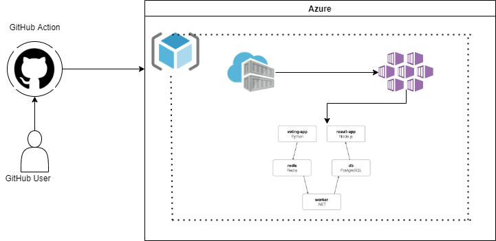

Example Voting App
=========

A simple distributed application running across Azure Kubernetes cluster.

Getting started
---------------

Application is deployed on the Azure Kubernetes Cluster

## Linux Containers

The Linux stack uses Python, Node.js, .NET Core (or optionally Java), with Redis for messaging and Postgres for storage.

> If you're using [Docker Desktop on Windows](https://store.docker.com/editions/community/docker-ce-desktop-windows), you can run the Linux version by [switching to Linux containers](https://docs.docker.com/docker-for-windows/#switch-between-windows-and-linux-containers), or run the Windows containers version.

Prerequisites
-------------------------
1. Azure Service Principal Accounts to authenticate the GitHub, Ansible with Azure.
2. GitHub repo with actions enabled.
3. GitHub repository action secrets

-------------------------
Build and Deploy Automation code
-------------------------
1. The folder azure_infra_with_ansible contains the AKS, ACR provision code in Ansible.
2. The folder kubernetes_manifests contains the yaml specifications of the Voting App's services.
3. .github/workflows/deploy_votingapp.yaml file to create a CI-CD process for build and deployment of App on kubernetes cluster.

Steps to provision Infra, build and deploy the app
-------------------------
1. clone and publish the repository to GitHub
2. create following service principals:
* Service Principal with federation credentials(for GitHub OIDC authentication- to main branch) - assign contributor role
* Service principal for Ansible - assign contributor role
3. create GitHub actions repository secrets for the following:
* AZURE_SUBSCRIPTION_ID - azure subscription id 
* AZURE_TENANT_ID - azure tenant id
* AZURE_CLIENT_ID - azure service principal client id created for GitHub OIDC authentication
* AZURE_CLIENT_ID_ANSIBLE - azure service principal client id created for ansible
* AZURE_CLIENT_SECRET_ANSIBLE - azure service principal client secret(value) created for ansible
* POSTGRES_USER - postgres username
* POSTGRES_PASSWORD - postgres passowrd
4. Go to actions, select the "voting app deployment to AKS" workflow, click Run Workflow, choose the environment type and run the workflow.

After the successfull execution of the workflow, vote app will be available on port 5000 and result app on port 5001 behind the respective kubernetes loadbalancer.

kubernetes yml files in kubernetes_manifests folder
-----
1. yaml files with hpa prefix are created for autosclaing of the pods based on cpu utilisation metric.
2. database-deployment.yaml file deploys the database pod and kubernetes persistent volume to persist the db data.
3. database-service.yaml file creates cluster-ip service for database in cluster.
4. redis-deployment.yaml file deploys redis pod in cluster
5. redis-service.yaml file creates the cluster-ip service in cluster
6. result-deployment.yaml file deploys the result pods in cluster
7. result-service.yaml file created the LoadBalancer service to expose the result app outside of cluster.
8. vote-deployment.yaml file deploys the vote app.
9. vote-service.yaml file creates the LoadBalancer service to expose the vote app outside of cluster.
10. worker-deployment.yaml file deploys the worker api.
11. worker-service.yaml file creates cluster ip to connect worker api with database.

Architecture
-----

* A front-end web app in [Python](/vote) or [ASP.NET Core](/vote/dotnet) which lets you vote between two options
* A [Redis](https://hub.docker.com/_/redis/) or [NATS](https://hub.docker.com/_/nats/) queue which collects new votes
* A [.NET Core](/worker/src/Worker), [Java](/worker/src/main) or [.NET Core 2.1](/worker/dotnet) worker which consumes votes and stores them in…
* A [Postgres](https://hub.docker.com/_/postgres/) or [TiDB](https://hub.docker.com/r/dockersamples/tidb/tags/) database backed by a Docker volume
* A [Node.js](/result) or [ASP.NET Core SignalR](/result/dotnet) webapp which shows the results of the voting in real time

Solution Diagram
-----

Vagrantfile
-----
vagrantfile is located in vagrant folder.

